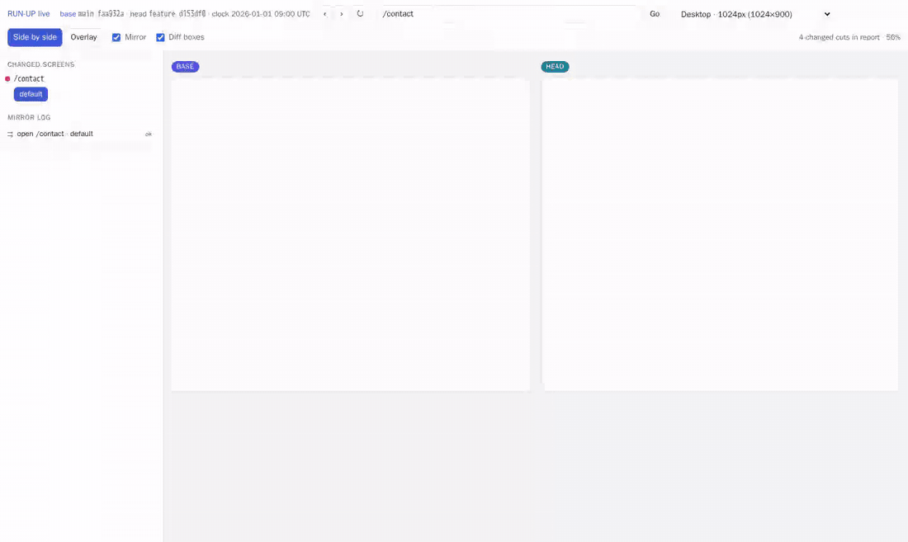

# RUN-UP

**머지 전에 명령 한 번: base와 head를 비교해 바뀐 화면만 보고서 한 장으로.**

[English](README.md)

`runup`은 웹앱을 git ref 두 개에서 비교한다. diff가 닿는 화면을 찾고, 앱을 두 번(base와 head, 각각 자기 git worktree에서) 띄운 뒤, 양쪽에서 같은 스크린샷을 찍어, 바뀐 컷만 담은 정적 보고서 한 장을 만든다. 프리뷰 배포를 돌아다니는 대신 몇십 초 안에 PR을 리뷰하는 것이 목적이다.

```
runup origin/main HEAD --pr 123
```

```
2/3 screens changed, 12/18 cuts changed, 1 unexpected, 0 skipped, 0 errors
UNEXPECTED: /blog/hello
.runup/090848f-94fb4a9/index.html
.runup/090848f-94fb4a9/report.json
```

## 하는 일

1. **바뀐 화면.** `git diff base...head`를 읽어 파일마다 route를 찾는다. Next.js App Router에서는 `page.*`가 화면이고, `layout`·`template`·`loading`·`error`·`not-found`는 그 아래 모든 페이지에 영향을 준다. route group `(x)`와 slot `@x`는 경로에서 빠지고, private 폴더 `_x`와 intercepting route는 화면이 아니다. 그 밖의 파일(컴포넌트, 훅, CSS)은 가벼운 import 그래프(상대 경로, tsconfig `paths`, `baseUrl`)를 따라 그 파일에 닿는 페이지와 레이아웃을 찾는다. route handler에만 닿는 파일은 화면과 무관하다. 어디에도 놓을 수 없는 파일이 있으면 설정의 기본 화면 세트를 더한다. PR 작성자는 화면을 더할 수 있다(`--expect`, `--expect-file`, PR 본문의 `runup` 블록).
2. **서버 두 대.** base와 head를 detached git worktree로 꺼내 같은 setup·seed·env로 설정의 포트에 띄운다.
3. **전후 화면.** 화면마다 폭 × light/dark × 상태로 찍는다. iframe, video, 설정한 선택자는 가리고, 애니메이션은 끄고, 시계는 고정한다. 비교는 [pixelmatch](https://github.com/mapbox/pixelmatch)로 하고, 바뀐 컷만 이미지를 남긴다. 처음에 달랐던 컷은 양쪽을 한 번 더 찍어, 다시 찍어도 다를 때만 바뀐 것으로 친다(느린 이미지·폰트로 인한 흔들림 제거).
4. **기기 에뮬레이션.** 같은 촬영을 Playwright 기기 프로필(기본 iPhone, Pixel, iPad) × Chromium·WebKit으로 한다.
5. **보고서 한 장.** `index.html`은 정적 페이지다. 바뀐 컷만, 전후 슬라이더, 바뀐 영역 상자, 기기 격자, 그리고 작성자가 적지 않은 화면이 바뀌면 **예상 밖 변경** 경고. `report.json`에는 도구와 에이전트가 읽을 같은 데이터가 들어 있다.

Playwright, pixelmatch, 정적 HTML만 쓴다. 업로드도, 서비스도 없다.

## 설치

Node 20+, git 2.36+가 필요하다.

```sh
git clone https://github.com/chaehy5665/runup.git
cd runup && npm install
npx playwright install chromium webkit
# Linux의 WebKit은 시스템 라이브러리도 필요하다:
sudo npx playwright install-deps webkit
npm link   # `runup`을 PATH에 둔다
```

브라우저를 띄울 수 없으면 실행을 멈추지 않고, 그 브라우저의 컷을 보고서에 skipped로 적는다.

## 사용

검사할 프로젝트에서 실행한다(또는 `-C <dir>`):

```sh
runup <base-ref> <head-ref> [options]

runup origin/main HEAD                       # diff에서 찾은 화면
runup origin/main HEAD --pr 123              # + PR #123 작성자 목록
runup origin/main HEAD -e '/en/blog/[slug]' -e /en
runup origin/main HEAD --plan                # 검사할 화면만 출력
runup origin/main HEAD --no-devices          # 뷰포트만
runup origin/main HEAD --base-url http://127.0.0.1:3001 --head-url http://127.0.0.1:3002
runup live origin/main HEAD                  # 두 버전을 실시간으로 나란히(아래 참고)
```

| 옵션 | |
|---|---|
| `-C, --cwd <dir>` | 대상 저장소 |
| `-c, --config <file>` | 설정 파일(기본: 저장소 루트의 `runup.config.{mjs,js,json}`) |
| `-e, --expect <screen>` | 작성자가 바뀔 것으로 예상하는 화면: 경로, route 패턴, glob(여러 번 가능) |
| `--expect-file <file>` | 한 줄에 화면 하나 |
| `--pr <number>` | GitHub PR 본문의 ```` ```runup ```` 블록을 읽는다(`gh` 사용) |
| `-o, --out <dir>` | 출력 루트(기본: 설정 `outDir`, `.runup`) |
| `--plan` / `--json` | 화면 계획을 출력하고 끝낸다(JSON 선택) |
| `--no-devices` | 기기 촬영을 건너뛴다 |
| `--base-url`, `--head-url` | 이미 떠 있는 서버를 쓴다 |
| `--keep-worktrees` | worktree를 남긴다. 같은 커밋으로 다시 돌리면 setup을 건너뛴다 |
| `--keep-all` | 바뀌지 않은 컷의 이미지도 남긴다 |
| `--fail-on unexpected\|change\|error` | 해당하면 종료 코드 2(CI·에이전트용) |

### 작성자 목록

PR 본문에 `runup` 코드 블록을 둔다. 경로, route 패턴, glob 모두 된다:

````md
```runup
/en/blog/[slug]
/en
/en/account/*
```
````

목록의 화면은 항상 검사한다. 바뀌었는데 목록에 없는 화면은 **예상 밖 변경**으로 보고한다. 목록이 없으면 예상 밖 변경을 판정하지 않고, 보고서에 그렇게 적는다.

## 라이브: 두 버전을 나란히

```sh
runup live origin/main HEAD
```

```
runup live: http://localhost:4545/
ssh -L 4545:127.0.0.1:4545 <this host>   # then open http://localhost:4545/
diff boxes: from the report for these commits
```



`runup live`는 보고서 실행과 같은 worktree 서버 두 대(같은 setup·seed·env)를 띄우고, 각각 앞에 작은 프록시를 두고, 포트 하나에서 비교 화면을 연다. 한쪽 창에서 한 일이 다른 쪽에서도 일어난다.

- **복제:** 스크롤(페이지와 스크롤되는 요소), 클릭, 글자 입력과 select, 키(Escape, Enter, 방향키 …), route 이동(링크, `pushState`, 뒤로·앞으로). 클릭은 요소 경로(id, `data-testid`, 형제 중 순서)로 먼저 찾고, 다른 쪽에 그 요소가 없으면 같은 자리에 같은 종류의 요소가 있을 때 그것을 누른다(**by position**). 그것도 없으면 **not found**를 표시한다. 둘 다 변경 신호이고 복제 기록에 남는다.
- 다른 쪽이 따라가지 못한 **route 이동**(한 버전만 하는 리디렉션 등)은 **route differs**로 표시한다.
- **기기 크기:** 폰·태블릿·데스크톱 프리셋과 설정의 폭·기기 프로필. 창은 프리셋의 크기, user agent(요청 헤더와 `navigator.userAgent`), `devicePixelRatio`를 받는다.
- **겹쳐 보기:** head를 base 위에 두고 투명도 슬라이더로 조절한다.
- **바뀐 화면:** diff(와 작성자 목록)에서 찾은 화면과 상태. 누르면 두 창이 함께 그 화면으로 가서 상태의 `query`와 `steps`를 적용한다.
- **diff 상자:** 같은 커밋의 보고서가 있으면(기본 `.runup/<base7>-<head7>/` 또는 `--report`) 지금 화면·상태·크기에 맞는 상자를 실시간 화면 위에 그리고, 스크롤을 따라 움직인다.
- **같은 시계:** 페이지 시계는 `capture.freezeTime`에서 시작해 흐른다(`--real-clock`으로 끈다).
- **다른 도메인 iframe**(영상 삽입, 결제 위젯)은 복제할 수 없어 **따로 조작(controlled separately)**으로 표시한다.

로컬 전용: 프록시는 창에 넣을 수 있도록 `X-Frame-Options`와 CSP `frame-ancestors`만 빼고, Host/Origin을 앱 서버 기준으로 바꾸며, WebSocket(HMR)은 그대로 통과시킨다. 앱과 다른 곳의 응답은 바뀌지 않는다. 127.0.0.1에서만 듣는다.

창 주소는 `http://base.localhost:<port>`와 `http://head.localhost:<port>`라서 Chrome·Edge·Firefox에서는 포트 하나, SSH 터널 하나면 된다. `*.localhost`를 풀지 못하는 브라우저에서는 `--split-ports`(base는 `<port>+1`, head는 `<port>+2`, 터널 세 개)를 쓴다.

| 라이브 옵션 | |
|---|---|
| `--port <n>` | 비교 화면 포트(기본: 설정 `live.port`, 4545) |
| `--report <path>` | diff 상자에 쓸 보고서 폴더나 `report.json` |
| `--split-ports` | 창마다 포트를 따로 쓴다 |
| `--real-clock` | 페이지 시계를 `capture.freezeTime`에서 시작하지 않는다 |

설정: `live: { port: 4545, host: '127.0.0.1', hosts: 'subdomain' | 'ports', freezeClock: true }`.

한계: 복제한 이벤트는 합성 이벤트라서 실제 동작이 필요한 브라우저 기본 동작(Tab 포커스 이동, 기본 select 팝업, 파일 선택, 드래그 앤 드롭)은 직접 만진 창에서만 일어난다. `run`이나 `localStorage`로 정의한 상태는 일부만 재현한다(`*` 표시). 색 모드는 OS를 따른다. `devicePixelRatio`는 스크립트에만 적용되고 CSS 해상도 미디어 쿼리는 실제 화면을 따른다.

## 설정

`runup.config.mjs`는 대상 저장소에 둔다. `server.start` 말고는 모두 선택이다. 전체 예시는 [README.md의 Config](README.md#config)를 보라. 주요 항목:

- `params`, `paths` — 동적 세그먼트(`[slug]` 등)의 예시 값
- `defaultScreens` — 변경을 화면에 놓을 수 없을 때 쓰는 기본 세트
- `exclude` — 찍지 않는 화면(로그인 전용 화면, admin 등). route 위의 glob에서 `[param]`과 `(group)`은 글자 그대로다
- `impact` — import 그래프보다 먼저 보는 명시적 매핑(`'all' | 'default' | 'none' | [paths]`)
- `states` — 화면 상태. `query`, `localStorage`, `steps`(`click`, `fill`, `press`, `waitFor` …), 또는 Playwright 코드 `run`
- `server` — `setup`, `copy`(저장소의 추적되지 않는 파일, 없으면 건너뛰고 보고서에 경고), `seed`, `start`, `ports`, `ready`, `worktreeDir`. 명령에는 `PORT`, `RUNUP_SIDE`, `RUNUP_REPO`, `RUNUP_WORKTREE`가 설정된다
- `capture` — `widths`, `colorSchemes`, `schemeInit`, `mask`, `hide`, `freezeTime`, `fullPage`, `maxHeight`
- `devices` — `profiles`, `browsers`, `colorSchemes`
- `compare` — `threshold`, `minDiffPixels`, `minDiffRatio`, `retakes`

대상 저장소의 `.gitignore`에 `.runup/`을 더한다.

## report.json

스키마 `runup.report/v1`. `summary`, `warnings`, `changedFiles`(파일 → 화면), `screens`(경로, route, 출처, expected, changed, unexpected), `cuts`(상태, 종류, 브라우저, 폭 또는 기기, 색 모드, `status`, `diffRatio`, `boxes`, 이미지 경로), `paths`. 이미지 경로는 `paths.reportDir` 기준 상대 경로다. 예시는 [README.md](README.md#reportjson)에 있다.

## 원격에서 보고서 보기

```sh
cd .runup/<run> && python3 -m http.server 8765
# 노트북에서
ssh -L 8765:127.0.0.1:8765 <host>   # http://localhost:8765 열기
```

## 개발

```sh
npm run lint
npm test            # 단위 테스트: 화면 찾기, diff 선택, 화면 목록, 설정, 라이브 프록시
npm run test:e2e    # examples/mini-app을 임시 git 저장소에서 CLI와 `runup live`로 끝까지 실행(Chromium 필요)
node scripts/record-demo.mjs   # 예제 앱으로 docs/live-demo.gif를 다시 녹화(ffmpeg 필요)
```

`examples/mini-app`은 App Router 파일 규칙(`page.html`, `layout.html`, `(group)`, `[param]`, `_private`)을 따르는 의존성 없는 앱이라, Next.js 없이 CI에서 전체 흐름을 돌릴 수 있다.

## 로드맵

MVP 밖:

- 로그인이 필요한 화면(양쪽 storage state, 테스트 계정)
- iOS Simulator와 실기기
- 컴포넌트 단위 격리(Storybook 방식)
- 접근성 검사(axe)
- Next.js App Router 외 프레임워크(Pages Router, Remix, Vite 라우트)
- 라이브: base와 head에 테스트 로그인 세션 공유(SUPERVISOR 결정)
- 라이브: 실제 폰에서 head 열기(Tailscale 같은 사설망 필요, "폰으로 열기" QR은 나중. SUPERVISOR 결정)

## 라이선스

MIT
